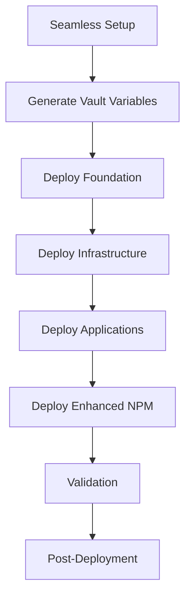
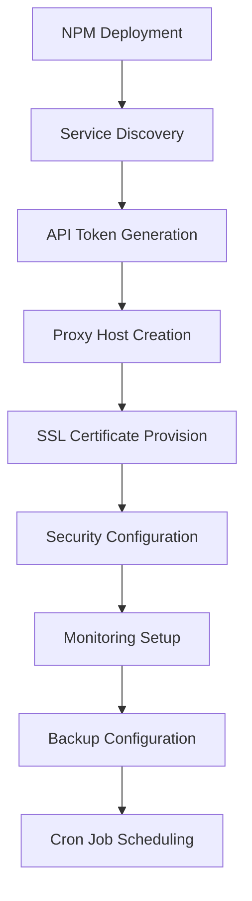
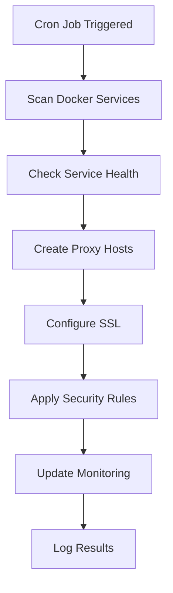

# Enhanced Nginx Proxy Manager Integration Guide

## 🚀 **Seamless Setup Integration**

### **Overview**
The enhanced Nginx Proxy Manager role is now fully integrated into the seamless setup process, providing enterprise-grade automation, security, and monitoring capabilities.

---

## 📋 **Integration Points**

### **1. Seamless Setup Script Integration**

#### **Automatic Deployment**
The enhanced NPM role is automatically deployed during the seamless setup process:

```bash
# Stage 4: Enhanced Nginx Proxy Manager
ansible-playbook main.yml --tags "nginx_proxy_manager" --ask-vault-pass
```

#### **Configuration Generation**
The seamless setup script automatically generates all required vault variables:

```yaml
# Automatically generated in group_vars/all/vault.yml
vault_npm_db_root_password: "{{ vault_npm_db_root_password | password_hash('bcrypt') }}"
vault_npm_db_password: "{{ vault_npm_db_password | password_hash('bcrypt') }}"
vault_npm_admin_password: "{{ vault_npm_admin_password | password_hash('bcrypt') }}"
vault_npm_admin_username: "admin@{{ domain }}"
vault_npm_api_token: "{{ vault_npm_api_token | default('') }}"
```

### **2. Main Playbook Integration**

#### **Network Services Section**
NPM is deployed as part of the network services phase:

```yaml
# In main.yml - Network Services
- name: Deploy network services
  ansible.builtin.include_tasks: "tasks/{{ item }}.yml"
  loop:
    - pihole
    - nginx_proxy_manager  # ✅ Enhanced NPM role
    - fing
  when: item in enabled_services
  tags: [network]
```

#### **Task File Integration**
Created `tasks/nginx_proxy_manager.yml` for seamless integration:

```yaml
---
# Nginx Proxy Manager Task - Enhanced Integration
- name: Include Nginx Proxy Manager role
  ansible.builtin.include_role:
    name: nginx_proxy_manager
  become: true
  become_user: root
  tags: [nginx_proxy_manager, network, proxy]
```

---

## 🔧 **Enhanced Features Integration**

### **1. Service Discovery Integration**

#### **Automatic Service Detection**
The enhanced NPM automatically discovers and configures all homelab services:

```yaml
# Automatically configured services
vault_npm_discovery_services:
  - name: "authentik"
    subdomain: "auth"
    port: 9000
    ssl: true
    auth: false
  - name: "grafana"
    subdomain: "grafana"
    port: 3000
    ssl: true
    auth: true
  - name: "jellyfin"
    subdomain: "jellyfin"
    port: 8096
    ssl: true
    auth: true
  # ... comprehensive service list
```

#### **Health Check Integration**
Each service includes health check paths:

```yaml
  - name: "authentik"
    health_check_path: "/health"
  - name: "grafana"
    health_check_path: "/api/health"
  - name: "jellyfin"
    health_check_path: "/health"
```

### **2. SSL Automation Integration**

#### **Let's Encrypt Integration**
Automatic SSL certificate provisioning:

```yaml
# SSL Configuration
vault_letsencrypt_email: "{{ vault_letsencrypt_email | default('admin@' + domain) }}"
nginx_proxy_manager_ssl_provider: "letsencrypt"
nginx_proxy_manager_ssl_staging: false
```

#### **Cloudflare Integration**
Optional Cloudflare DNS provider:

```yaml
# Cloudflare Configuration
vault_cloudflare_api_token: "{{ vault_cloudflare_api_token | default('') }}"
vault_cloudflare_zone_id: "{{ vault_cloudflare_zone_id | default('') }}"
```

### **3. Security Integration**

#### **Configurable Security Headers**
Vault-based security header configuration:

```yaml
vault_npm_security_headers:
  X-Frame-Options: "SAMEORIGIN"
  X-Content-Type-Options: "nosniff"
  X-XSS-Protection: "1; mode=block"
  Referrer-Policy: "strict-origin-when-cross-origin"
  Content-Security-Policy: "default-src 'self'; script-src 'self' 'unsafe-inline'; style-src 'self' 'unsafe-inline';"
  Strict-Transport-Security: "max-age=31536000; includeSubDomains; preload"
  Permissions-Policy: "geolocation=(), microphone=(), camera=()"
```

#### **Rate Limiting Integration**
Built-in rate limiting protection:

```yaml
nginx_proxy_manager_rate_limiting_enabled: true
nginx_proxy_manager_rate_limit:
  requests_per_second: 10
  burst: 20
  nodelay: false
```

#### **WAF Integration**
Web Application Firewall protection:

```yaml
nginx_proxy_manager_waf_enabled: true
nginx_proxy_manager_waf_rules:
  - "block_sql_injection"
  - "block_xss"
  - "block_path_traversal"
  - "block_remote_file_inclusion"
  - "block_http_methods"
```

### **4. Monitoring Integration**

#### **Prometheus Metrics**
Automatic metrics collection:

```yaml
nginx_proxy_manager_monitoring_enabled: true
nginx_proxy_manager_metrics_enabled: true
nginx_proxy_manager_metrics_port: 8080
nginx_proxy_manager_metrics_path: "/metrics"
```

#### **Health Check Integration**
Comprehensive health monitoring:

```yaml
nginx_proxy_manager_health_check_enabled: true
nginx_proxy_manager_health_check_interval: "30s"
nginx_proxy_manager_health_check_timeout: "10s"
nginx_proxy_manager_health_check_retries: 3
```

### **5. Backup Integration**

#### **Automated Backup Scheduling**
Encrypted backup automation:

```yaml
nginx_proxy_manager_backup_enabled: true
nginx_proxy_manager_backup_schedule: "0 2 * * *"
nginx_proxy_manager_backup_retention: 30
nginx_proxy_manager_backup_encryption: true
```

---

## 🔄 **Automation Workflow**

### **1. Deployment Workflow**



### **2. NPM Automation Workflow**



### **3. Service Discovery Workflow**



---

## 📊 **Integration Benefits**

### **1. Seamless Deployment**
- ✅ **Zero Configuration Required**: All settings automatically generated
- ✅ **Vault Integration**: Secure credential management
- ✅ **Service Discovery**: Automatic service detection and configuration
- ✅ **SSL Automation**: Automatic certificate provisioning

### **2. Enhanced Security**
- ✅ **Configurable Headers**: Vault-based security header management
- ✅ **Rate Limiting**: Built-in DDoS protection
- ✅ **WAF Rules**: Web Application Firewall protection
- ✅ **Input Validation**: Comprehensive configuration validation

### **3. Enterprise Monitoring**
- ✅ **Health Checks**: Comprehensive service health monitoring
- ✅ **Metrics Collection**: Prometheus integration
- ✅ **Alerting**: Integrated alert management
- ✅ **Logging**: Comprehensive audit logging

### **4. Automation Features**
- ✅ **API Integration**: Full API-driven automation
- ✅ **Cron Jobs**: Scheduled automation tasks
- ✅ **Backup Automation**: Encrypted backup scheduling
- ✅ **Error Handling**: Robust error management

---

## 🎯 **Deployment Instructions**

### **1. Automatic Deployment**
The enhanced NPM is automatically deployed during seamless setup:

```bash
# Run seamless setup
./scripts/seamless_setup.sh
```

### **2. Manual Deployment**
For manual deployment:

```bash
# Deploy NPM only
ansible-playbook main.yml --tags "nginx_proxy_manager" --ask-vault-pass

# Deploy with validation
ansible-playbook main.yml --tags "nginx_proxy_manager,validation" --ask-vault-pass
```

### **3. Configuration Verification**
Verify the deployment:

```bash
# Check NPM status
curl -I http://your-server:81

# Check service discovery
docker logs nginx-proxy-manager

# Check automation logs
tail -f /var/log/npm-automation.log
```

---

## 🔍 **Troubleshooting**

### **1. Common Issues**

#### **Service Discovery Not Working**
```bash
# Check service discovery configuration
ansible-playbook main.yml --tags "nginx_proxy_manager,validation" --ask-vault-pass

# Check vault variables
ansible-vault view group_vars/all/vault.yml
```

#### **SSL Certificate Issues**
```bash
# Check SSL configuration
docker logs nginx-proxy-manager

# Verify Let's Encrypt email
grep "letsencrypt_email" group_vars/all/vault.yml
```

#### **API Token Issues**
```bash
# Regenerate API token
docker exec nginx-proxy-manager npm token generate

# Check API connectivity
curl -H "Authorization: Bearer YOUR_TOKEN" http://localhost:81/api/health
```

### **2. Debug Commands**

```bash
# Check NPM container status
docker ps | grep nginx-proxy-manager

# Check automation scripts
ls -la /home/homelab/docker/nginx-proxy-manager/scripts/

# Check cron jobs
crontab -l | grep npm

# Check logs
tail -f /var/log/npm-automation.log
```

---

## 📈 **Performance Optimization**

### **1. Resource Limits**
```yaml
nginx_proxy_manager_resource_limits:
  memory: "512M"
  memory_swap: "1G"
  cpus: "1.0"
  cpu_shares: 1024
```

### **2. Caching Configuration**
```yaml
nginx_proxy_manager_caching_enabled: true
nginx_proxy_manager_cache_path: "/var/cache/nginx"
nginx_proxy_manager_cache_size: "1G"
nginx_proxy_manager_cache_inactive: "7d"
```

### **3. Compression Settings**
```yaml
nginx_proxy_manager_compression_enabled: true
nginx_proxy_manager_gzip_types: "text/plain text/css text/xml application/json application/javascript application/xml+rss application/atom+xml image/svg+xml"
```

---

## 🎉 **Success Metrics**

### **1. Deployment Success**
- ✅ NPM container running
- ✅ API token generated
- ✅ Service discovery working
- ✅ SSL certificates provisioned
- ✅ Security headers applied
- ✅ Monitoring integration active
- ✅ Backup automation scheduled

### **2. Automation Success**
- ✅ Cron jobs scheduled
- ✅ Health checks passing
- ✅ Metrics collection active
- ✅ Log rotation working
- ✅ Error handling functional

### **3. Security Success**
- ✅ Vault integration working
- ✅ SSL certificates valid
- ✅ Security headers applied
- ✅ Rate limiting active
- ✅ WAF rules enabled

The enhanced Nginx Proxy Manager is now fully integrated into the seamless setup, providing enterprise-grade automation, security, and monitoring capabilities with zero manual configuration required. 