# Architecture Documentation: Homelab System Design

## Table of Contents

1. [System Overview](#system-overview)
2. [Network Architecture](#network-architecture)
3. [Service Architecture](#service-architecture)
4. [Data Flow Diagrams](#data-flow-diagrams)
5. [Security Architecture](#security-architecture)
6. [Deployment Architecture](#deployment-architecture)
7. [Monitoring Architecture](#monitoring-architecture)
8. [Backup Architecture](#backup-architecture)

---

## System Overview

### High-Level Architecture

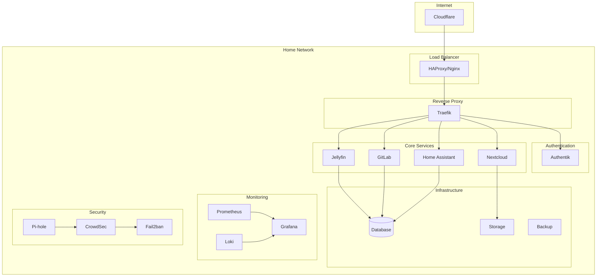
```mermaid
graph TB
    subgraph "Internet"
        CF[Cloudflare]
    end
    
    subgraph "Home Network"
        subgraph "Load Balancer"
            LB[HAProxy/Nginx]
        end
        
        subgraph "Reverse Proxy"
            TR[Traefik]
        end
        
        subgraph "Authentication"
            AK[Authentik]
        end
        
        subgraph "Core Services"
            JF[Jellyfin]
            NC[Nextcloud]
            GL[GitLab]
            HA[Home Assistant]
        end
        
        subgraph "Infrastructure"
            DB[(Database)]
            ST[Storage]
            BK[Backup]
        end
        
        subgraph "Monitoring"
            PM[Prometheus]
            GF[Grafana]
            LK[Loki]
        end
        
        subgraph "Security"
            PH[Pi-hole]
            CS[CrowdSec]
            F2B[Fail2ban]
        end
    end
    
    CF --> LB
    LB --> TR
    TR --> AK
    TR --> JF
    TR --> NC
    TR --> GL
    TR --> HA
    JF --> DB
    NC --> ST
    GL --> DB
    HA --> DB
    PM --> GF
    LK --> GF
    PH --> CS
    CS --> F2B
```

### System Components

#### Core Infrastructure
- **Load Balancer**: Distributes traffic across multiple servers
- **Reverse Proxy**: Routes requests to appropriate services
- **Authentication**: Single sign-on for all services
- **Database**: Centralized data storage
- **Storage**: File and media storage systems

#### Service Categories
- **Media Services**: Jellyfin, Sonarr, Radarr, etc.
- **File Services**: Nextcloud, Samba, Syncthing
- **Development**: GitLab, Harbor, CI/CD
- **Home Automation**: Home Assistant, MQTT
- **Security**: Pi-hole, CrowdSec, Fail2ban
- **Monitoring**: Prometheus, Grafana, Loki

---

## Network Architecture

### Network Topology

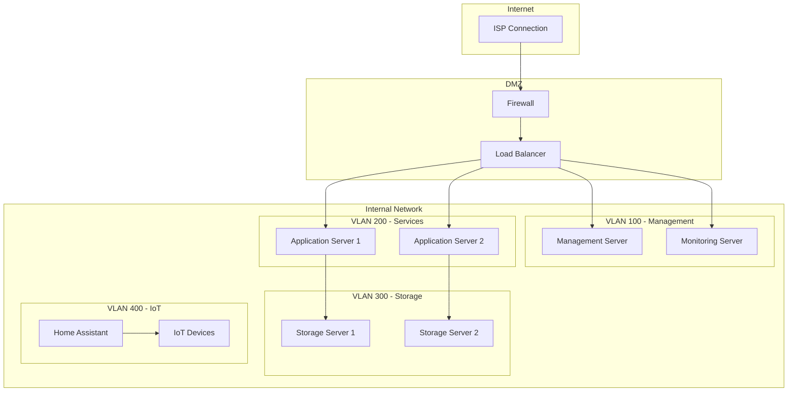
```mermaid
graph TB
    subgraph "Internet"
        ISP[ISP Connection]
    end
    
    subgraph "DMZ"
        FW[Firewall]
        LB[Load Balancer]
    end
    
    subgraph "Internal Network"
        subgraph "VLAN 100 - Management"
            MGMT[Management Server]
            MON[Monitoring Server]
        end
        
        subgraph "VLAN 200 - Services"
            APP1[Application Server 1]
            APP2[Application Server 2]
        end
        
        subgraph "VLAN 300 - Storage"
            STOR1[Storage Server 1]
            STOR2[Storage Server 2]
        end
        
        subgraph "VLAN 400 - IoT"
            IOT[IoT Devices]
            HA[Home Assistant]
        end
    end
    
    ISP --> FW
    FW --> LB
    LB --> MGMT
    LB --> MON
    LB --> APP1
    LB --> APP2
    APP1 --> STOR1
    APP2 --> STOR2
    HA --> IOT
```

### Network Segmentation

#### VLAN Configuration
- **VLAN 100 (Management)**: Network management, monitoring, and administration
- **VLAN 200 (Services)**: Application servers and services
- **VLAN 300 (Storage)**: Storage servers and backup systems
- **VLAN 400 (IoT)**: Smart home devices and IoT equipment

#### Firewall Rules
```yaml
# Management VLAN (100)
- Allow: SSH, HTTPS, monitoring ports
- Deny: All other traffic

# Services VLAN (200)
- Allow: HTTP, HTTPS, application ports
- Allow: Database connections
- Deny: Direct internet access

# Storage VLAN (300)
- Allow: Storage protocols (NFS, SMB, iSCSI)
- Allow: Backup connections
- Deny: All other traffic

# IoT VLAN (400)
- Allow: MQTT, Zigbee, Z-Wave
- Allow: Limited internet access
- Deny: Access to other VLANs
```

### DNS Architecture

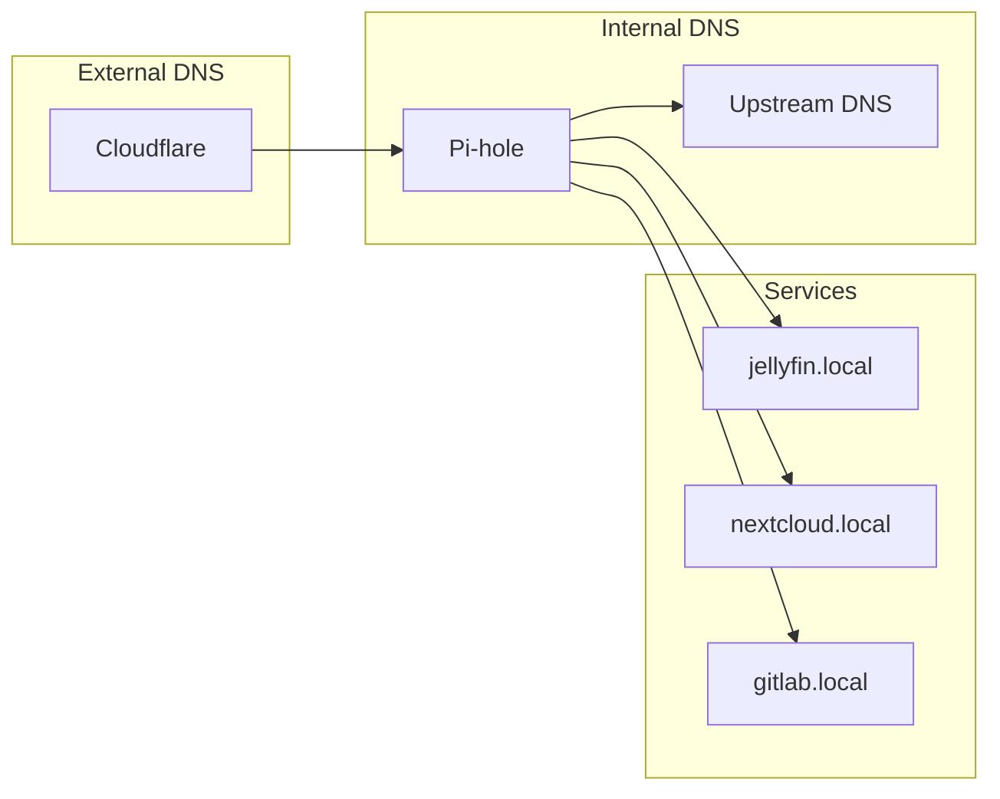
```mermaid
graph LR
    subgraph "External DNS"
        CF[Cloudflare]
    end
    
    subgraph "Internal DNS"
        PH[Pi-hole]
        UP[Upstream DNS]
    end
    
    subgraph "Services"
        JF[jellyfin.local]
        NC[nextcloud.local]
        GL[gitlab.local]
    end
    
    CF --> PH
    PH --> UP
    PH --> JF
    PH --> NC
    PH --> GL
```

---

## Service Architecture

### Service Dependencies

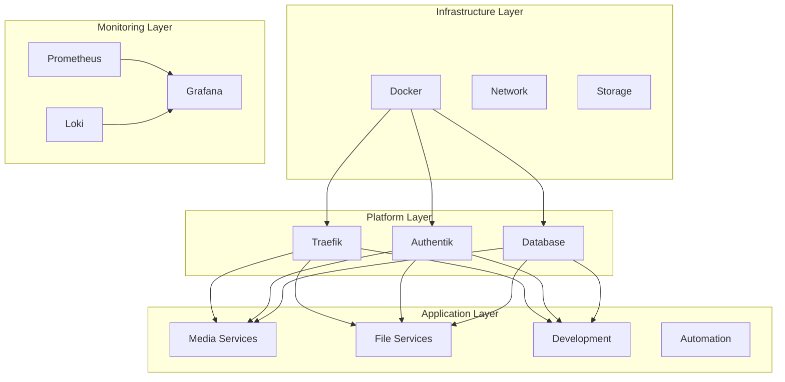
```mermaid
graph TB
    subgraph "Infrastructure Layer"
        DOCKER[Docker]
        NETWORK[Network]
        STORAGE[Storage]
    end
    
    subgraph "Platform Layer"
        TRAEFIK[Traefik]
        AUTHENTIK[Authentik]
        DATABASE[Database]
    end
    
    subgraph "Application Layer"
        MEDIA[Media Services]
        FILE[File Services]
        DEV[Development]
        AUTO[Automation]
    end
    
    subgraph "Monitoring Layer"
        PROM[Prometheus]
        GRAFANA[Grafana]
        LOKI[Loki]
    end
    
    DOCKER --> TRAEFIK
    DOCKER --> AUTHENTIK
    DOCKER --> DATABASE
    TRAEFIK --> MEDIA
    TRAEFIK --> FILE
    TRAEFIK --> DEV
    AUTHENTIK --> MEDIA
    AUTHENTIK --> FILE
    AUTHENTIK --> DEV
    DATABASE --> MEDIA
    DATABASE --> FILE
    DATABASE --> DEV
    PROM --> GRAFANA
    LOKI --> GRAFANA
```

### Container Architecture

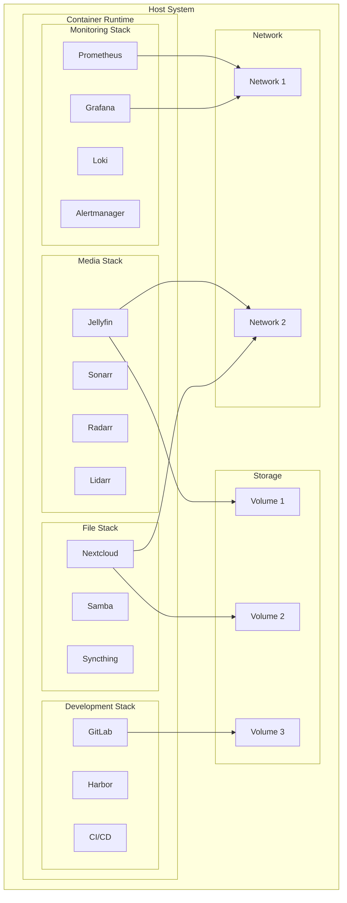
```mermaid
graph TB
    subgraph "Host System"
        subgraph "Container Runtime"
            subgraph "Media Stack"
                JF[Jellyfin]
                SR[Sonarr]
                RR[Radarr]
                LR[Lidarr]
            end
            
            subgraph "File Stack"
                NC[Nextcloud]
                SM[Samba]
                ST[Syncthing]
            end
            
            subgraph "Development Stack"
                GL[GitLab]
                HB[Harbor]
                CI[CI/CD]
            end
            
            subgraph "Monitoring Stack"
                PM[Prometheus]
                GF[Grafana]
                LK[Loki]
                AL[Alertmanager]
            end
        end
        
        subgraph "Storage"
            VOL1[Volume 1]
            VOL2[Volume 2]
            VOL3[Volume 3]
        end
        
        subgraph "Network"
            NET1[Network 1]
            NET2[Network 2]
        end
    end
    
    JF --> VOL1
    NC --> VOL2
    GL --> VOL3
    PM --> NET1
    GF --> NET1
    JF --> NET2
    NC --> NET2
```

---

## Data Flow Diagrams

### User Request Flow

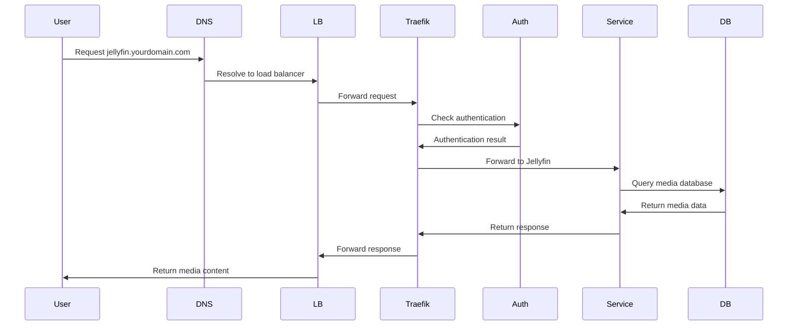
```mermaid
sequenceDiagram
    participant User
    participant DNS
    participant LB
    participant Traefik
    participant Auth
    participant Service
    participant DB
    
    User->>DNS: Request jellyfin.yourdomain.com
    DNS->>LB: Resolve to load balancer
    LB->>Traefik: Forward request
    Traefik->>Auth: Check authentication
    Auth->>Traefik: Authentication result
    Traefik->>Service: Forward to Jellyfin
    Service->>DB: Query media database
    DB->>Service: Return media data
    Service->>Traefik: Return response
    Traefik->>LB: Forward response
    LB->>User: Return media content
```

### Media Download Flow

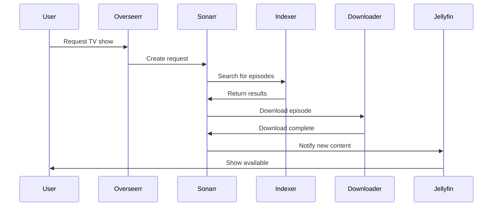
```mermaid
sequenceDiagram
    participant User
    participant Overseerr
    participant Sonarr
    participant Indexer
    participant Downloader
    participant Jellyfin
    
    User->>Overseerr: Request TV show
    Overseerr->>Sonarr: Create request
    Sonarr->>Indexer: Search for episodes
    Indexer->>Sonarr: Return results
    Sonarr->>Downloader: Download episode
    Downloader->>Sonarr: Download complete
    Sonarr->>Jellyfin: Notify new content
    Jellyfin->>User: Show available
```

### Monitoring Data Flow

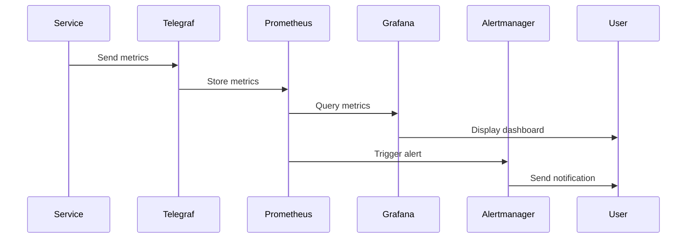
```mermaid
sequenceDiagram
    participant Service
    participant Telegraf
    participant Prometheus
    participant Grafana
    participant Alertmanager
    
    Service->>Telegraf: Send metrics
    Telegraf->>Prometheus: Store metrics
    Prometheus->>Grafana: Query metrics
    Grafana->>User: Display dashboard
    Prometheus->>Alertmanager: Trigger alert
    Alertmanager->>User: Send notification
```

---

## Security Architecture

### Security Layers

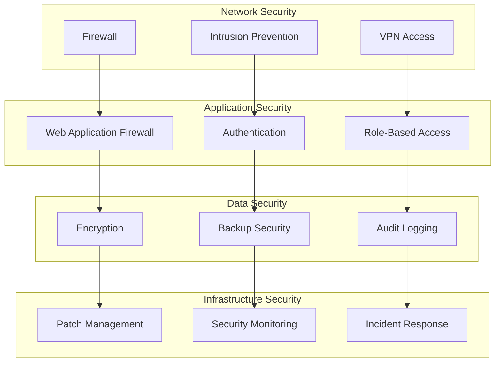
```mermaid
graph TB
    subgraph "Network Security"
        FW[Firewall]
        IPS[Intrusion Prevention]
        VPN[VPN Access]
    end
    
    subgraph "Application Security"
        WAF[Web Application Firewall]
        AUTH[Authentication]
        RBAC[Role-Based Access]
    end
    
    subgraph "Data Security"
        ENC[Encryption]
        BACKUP[Backup Security]
        AUDIT[Audit Logging]
    end
    
    subgraph "Infrastructure Security"
        PATCH[Patch Management]
        MONITOR[Security Monitoring]
        INCIDENT[Incident Response]
    end
    
    FW --> WAF
    IPS --> AUTH
    VPN --> RBAC
    WAF --> ENC
    AUTH --> BACKUP
    RBAC --> AUDIT
    ENC --> PATCH
    BACKUP --> MONITOR
    AUDIT --> INCIDENT
```

### Authentication Flow

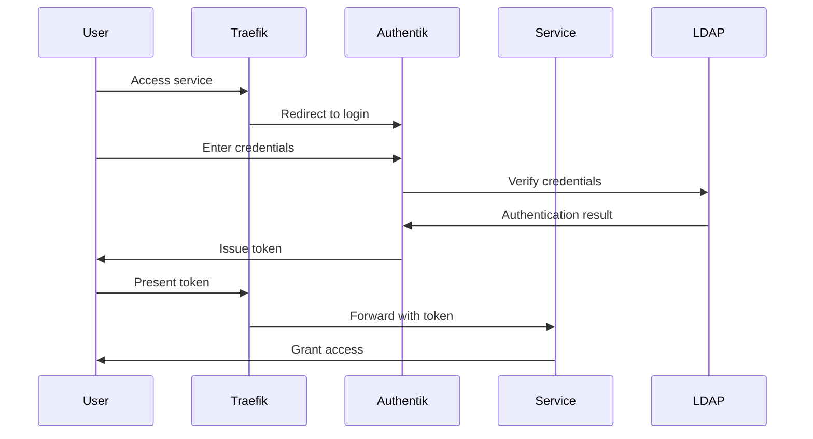
```mermaid
sequenceDiagram
    participant User
    participant Traefik
    participant Authentik
    participant Service
    participant LDAP
    
    User->>Traefik: Access service
    Traefik->>Authentik: Redirect to login
    User->>Authentik: Enter credentials
    Authentik->>LDAP: Verify credentials
    LDAP->>Authentik: Authentication result
    Authentik->>User: Issue token
    User->>Traefik: Present token
    Traefik->>Service: Forward with token
    Service->>User: Grant access
```

### Security Monitoring

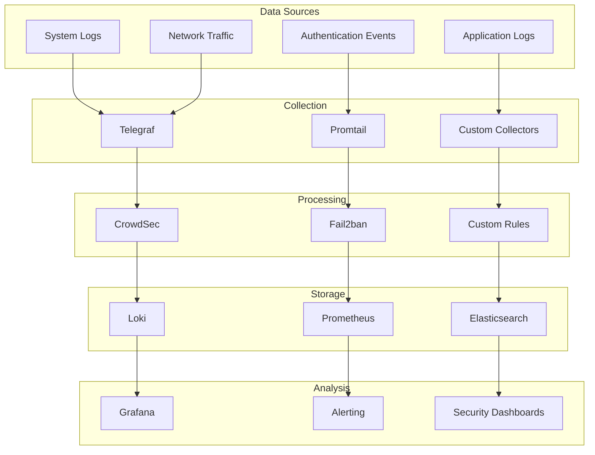
```mermaid
graph TB
    subgraph "Data Sources"
        LOGS[System Logs]
        NETWORK[Network Traffic]
        AUTH[Authentication Events]
        APPS[Application Logs]
    end
    
    subgraph "Collection"
        TELEGRAF[Telegraf]
        PROMTAIL[Promtail]
        CROWD[Custom Collectors]
    end
    
    subgraph "Processing"
        CROWDSEC[CrowdSec]
        FAIL2BAN[Fail2ban]
        CUSTOM[Custom Rules]
    end
    
    subgraph "Storage"
        LOKI[Loki]
        PROM[Prometheus]
        ES[Elasticsearch]
    end
    
    subgraph "Analysis"
        GRAFANA[Grafana]
        ALERTS[Alerting]
        DASH[Security Dashboards]
    end
    
    LOGS --> TELEGRAF
    NETWORK --> TELEGRAF
    AUTH --> PROMTAIL
    APPS --> CROWD
    TELEGRAF --> CROWDSEC
    PROMTAIL --> FAIL2BAN
    CROWD --> CUSTOM
    CROWDSEC --> LOKI
    FAIL2BAN --> PROM
    CUSTOM --> ES
    LOKI --> GRAFANA
    PROM --> ALERTS
    ES --> DASH
```

---

## Deployment Architecture

### Multi-Server Deployment

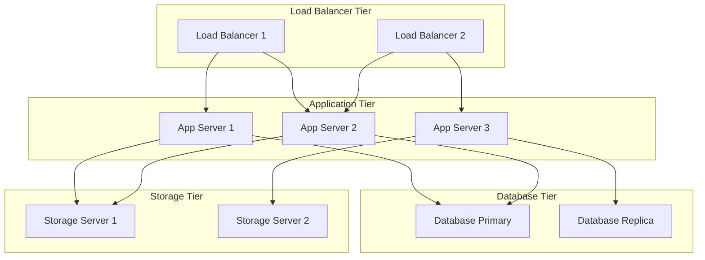
```mermaid
graph TB
    subgraph "Load Balancer Tier"
        LB1[Load Balancer 1]
        LB2[Load Balancer 2]
    end
    
    subgraph "Application Tier"
        APP1[App Server 1]
        APP2[App Server 2]
        APP3[App Server 3]
    end
    
    subgraph "Database Tier"
        DB1[Database Primary]
        DB2[Database Replica]
    end
    
    subgraph "Storage Tier"
        STOR1[Storage Server 1]
        STOR2[Storage Server 2]
    end
    
    LB1 --> APP1
    LB1 --> APP2
    LB2 --> APP2
    LB2 --> APP3
    APP1 --> DB1
    APP2 --> DB1
    APP3 --> DB2
    APP1 --> STOR1
    APP2 --> STOR1
    APP3 --> STOR2
```

### Container Orchestration

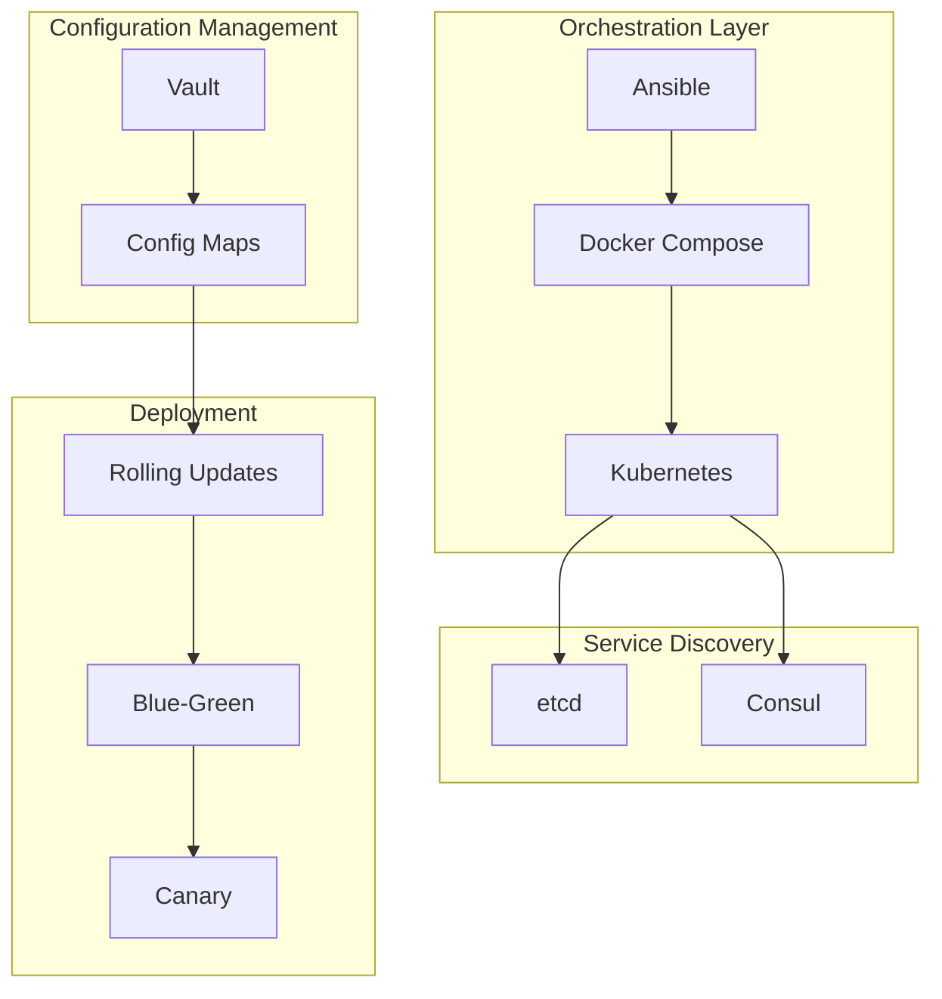
```mermaid
graph TB
    subgraph "Orchestration Layer"
        ANSIBLE[Ansible]
        DOCKER[Docker Compose]
        K8S[Kubernetes]
    end
    
    subgraph "Service Discovery"
        ETCD[etcd]
        CONSUL[Consul]
    end
    
    subgraph "Configuration Management"
        VAULT[Vault]
        CONFIG[Config Maps]
    end
    
    subgraph "Deployment"
        ROLLING[Rolling Updates]
        BLUE[Blue-Green]
        CANARY[Canary]
    end
    
    ANSIBLE --> DOCKER
    DOCKER --> K8S
    K8S --> ETCD
    K8S --> CONSUL
    VAULT --> CONFIG
    CONFIG --> ROLLING
    ROLLING --> BLUE
    BLUE --> CANARY
```

---

## Monitoring Architecture

### Monitoring Stack

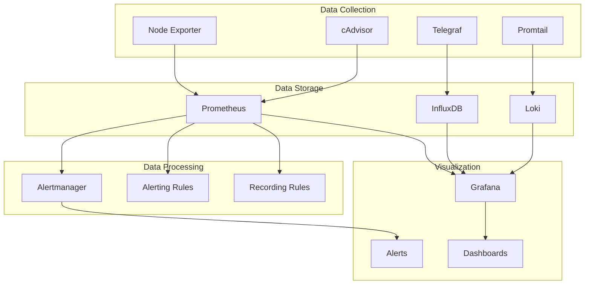
```mermaid
graph TB
    subgraph "Data Collection"
        NODE[Node Exporter]
        CADVISOR[cAdvisor]
        TELEGRAF[Telegraf]
        PROMTAIL[Promtail]
    end
    
    subgraph "Data Storage"
        PROM[Prometheus]
        LOKI[Loki]
        INFLUX[InfluxDB]
    end
    
    subgraph "Data Processing"
        ALERTMANAGER[Alertmanager]
        RULES[Alerting Rules]
        RECORDING[Recording Rules]
    end
    
    subgraph "Visualization"
        GRAFANA[Grafana]
        DASHBOARDS[Dashboards]
        ALERTS[Alerts]
    end
    
    NODE --> PROM
    CADVISOR --> PROM
    TELEGRAF --> INFLUX
    PROMTAIL --> LOKI
    PROM --> ALERTMANAGER
    PROM --> RULES
    PROM --> RECORDING
    PROM --> GRAFANA
    LOKI --> GRAFANA
    INFLUX --> GRAFANA
    ALERTMANAGER --> ALERTS
    GRAFANA --> DASHBOARDS
```

### Metrics Collection

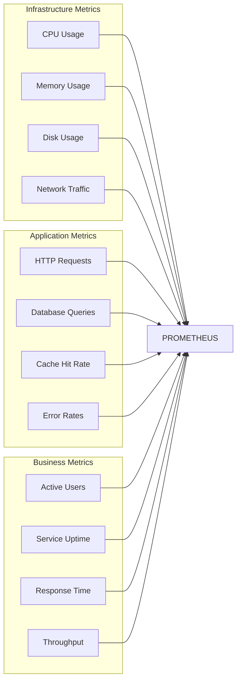
```mermaid
graph LR
    subgraph "Infrastructure Metrics"
        CPU[CPU Usage]
        MEM[Memory Usage]
        DISK[Disk Usage]
        NET[Network Traffic]
    end
    
    subgraph "Application Metrics"
        HTTP[HTTP Requests]
        DB[Database Queries]
        CACHE[Cache Hit Rate]
        ERRORS[Error Rates]
    end
    
    subgraph "Business Metrics"
        USERS[Active Users]
        UPTIME[Service Uptime]
        PERFORMANCE[Response Time]
        THROUGHPUT[Throughput]
    end
    
    CPU --> PROMETHEUS
    MEM --> PROMETHEUS
    DISK --> PROMETHEUS
    NET --> PROMETHEUS
    HTTP --> PROMETHEUS
    DB --> PROMETHEUS
    CACHE --> PROMETHEUS
    ERRORS --> PROMETHEUS
    USERS --> PROMETHEUS
    UPTIME --> PROMETHEUS
    PERFORMANCE --> PROMETHEUS
    THROUGHPUT --> PROMETHEUS
```

---

## Backup Architecture

### Backup Strategy

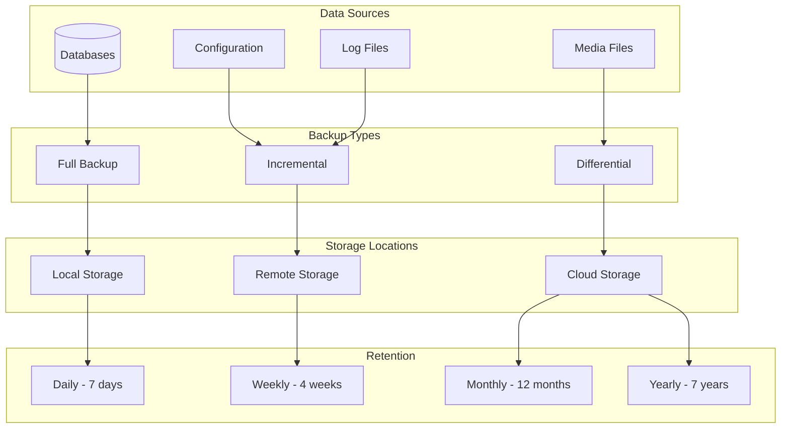
```mermaid
graph TB
    subgraph "Data Sources"
        DB[(Databases)]
        CONFIG[Configuration]
        MEDIA[Media Files]
        LOGS[Log Files]
    end
    
    subgraph "Backup Types"
        FULL[Full Backup]
        INCREMENTAL[Incremental]
        DIFFERENTIAL[Differential]
    end
    
    subgraph "Storage Locations"
        LOCAL[Local Storage]
        REMOTE[Remote Storage]
        CLOUD[Cloud Storage]
    end
    
    subgraph "Retention"
        DAILY[Daily - 7 days]
        WEEKLY[Weekly - 4 weeks]
        MONTHLY[Monthly - 12 months]
        YEARLY[Yearly - 7 years]
    end
    
    DB --> FULL
    CONFIG --> INCREMENTAL
    MEDIA --> DIFFERENTIAL
    LOGS --> INCREMENTAL
    FULL --> LOCAL
    INCREMENTAL --> REMOTE
    DIFFERENTIAL --> CLOUD
    LOCAL --> DAILY
    REMOTE --> WEEKLY
    CLOUD --> MONTHLY
    CLOUD --> YEARLY
```

### Disaster Recovery

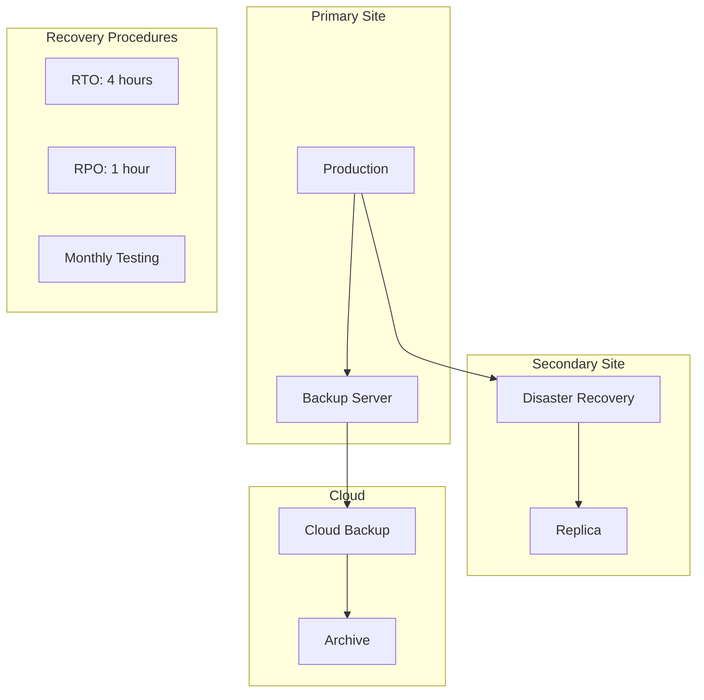
```mermaid
graph TB
    subgraph "Primary Site"
        PROD[Production]
        BACKUP[Backup Server]
    end
    
    subgraph "Secondary Site"
        DR[Disaster Recovery]
        REPLICA[Replica]
    end
    
    subgraph "Cloud"
        CLOUD[Cloud Backup]
        ARCHIVE[Archive]
    end
    
    PROD --> BACKUP
    PROD --> DR
    BACKUP --> CLOUD
    DR --> REPLICA
    CLOUD --> ARCHIVE
    
    subgraph "Recovery Procedures"
        RTO[RTO: 4 hours]
        RPO[RPO: 1 hour]
        TEST[Monthly Testing]
    end
```

### Backup Verification

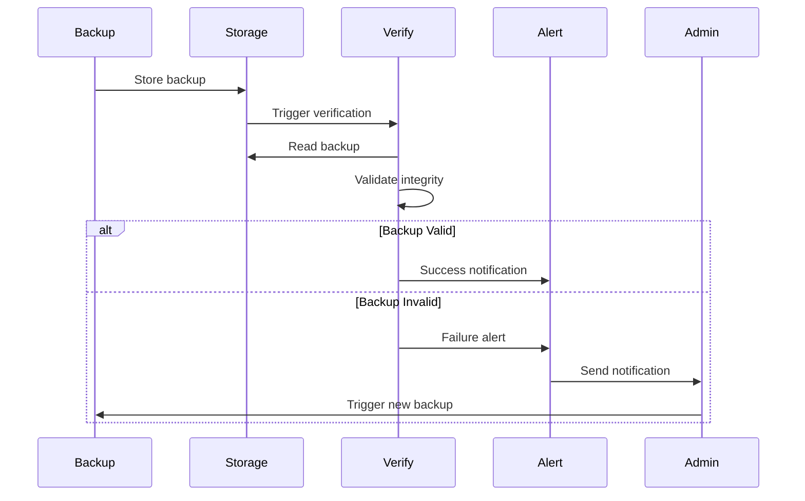
```mermaid
sequenceDiagram
    participant Backup
    participant Storage
    participant Verify
    participant Alert
    participant Admin
    
    Backup->>Storage: Store backup
    Storage->>Verify: Trigger verification
    Verify->>Storage: Read backup
    Verify->>Verify: Validate integrity
    alt Backup Valid
        Verify->>Alert: Success notification
    else Backup Invalid
        Verify->>Alert: Failure alert
        Alert->>Admin: Send notification
        Admin->>Backup: Trigger new backup
    end
```

---

## Performance Architecture

### Performance Optimization

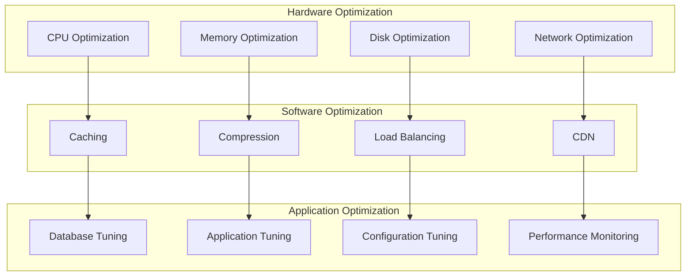
```mermaid
graph TB
    subgraph "Hardware Optimization"
        CPU[CPU Optimization]
        RAM[Memory Optimization]
        DISK[Disk Optimization]
        NET[Network Optimization]
    end
    
    subgraph "Software Optimization"
        CACHE[Caching]
        COMPRESSION[Compression]
        LOAD[Load Balancing]
        CDN[CDN]
    end
    
    subgraph "Application Optimization"
        DB[Database Tuning]
        APP[Application Tuning]
        CONFIG[Configuration Tuning]
        MONITOR[Performance Monitoring]
    end
    
    CPU --> CACHE
    RAM --> COMPRESSION
    DISK --> LOAD
    NET --> CDN
    CACHE --> DB
    COMPRESSION --> APP
    LOAD --> CONFIG
    CDN --> MONITOR
```

### Scalability Patterns

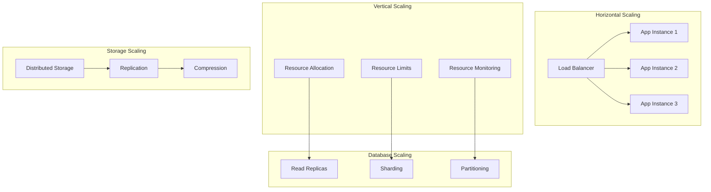
```mermaid
graph TB
    subgraph "Horizontal Scaling"
        LB[Load Balancer]
        APP1[App Instance 1]
        APP2[App Instance 2]
        APP3[App Instance 3]
    end
    
    subgraph "Vertical Scaling"
        RESOURCES[Resource Allocation]
        LIMITS[Resource Limits]
        MONITORING[Resource Monitoring]
    end
    
    subgraph "Database Scaling"
        READ[Read Replicas]
        SHARD[Sharding]
        PARTITION[Partitioning]
    end
    
    subgraph "Storage Scaling"
        DISTRIBUTED[Distributed Storage]
        REPLICATION[Replication]
        COMPRESSION[Compression]
    end
    
    LB --> APP1
    LB --> APP2
    LB --> APP3
    RESOURCES --> READ
    LIMITS --> SHARD
    MONITORING --> PARTITION
    DISTRIBUTED --> REPLICATION
    REPLICATION --> COMPRESSION
```

This comprehensive architecture documentation provides detailed technical diagrams and explanations of the homelab system design, covering all aspects from network topology to performance optimization. 