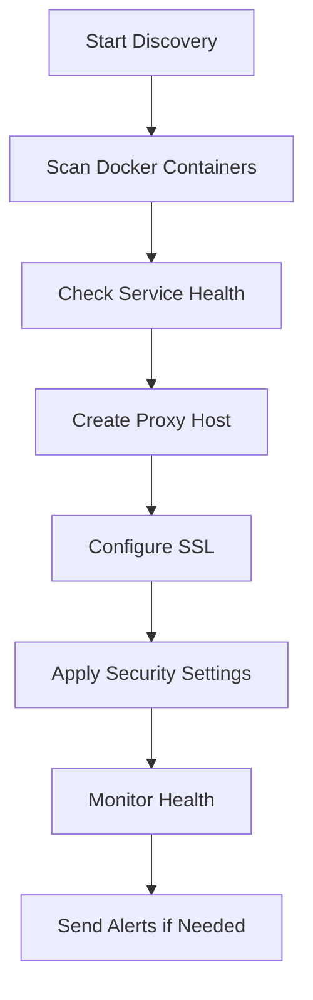
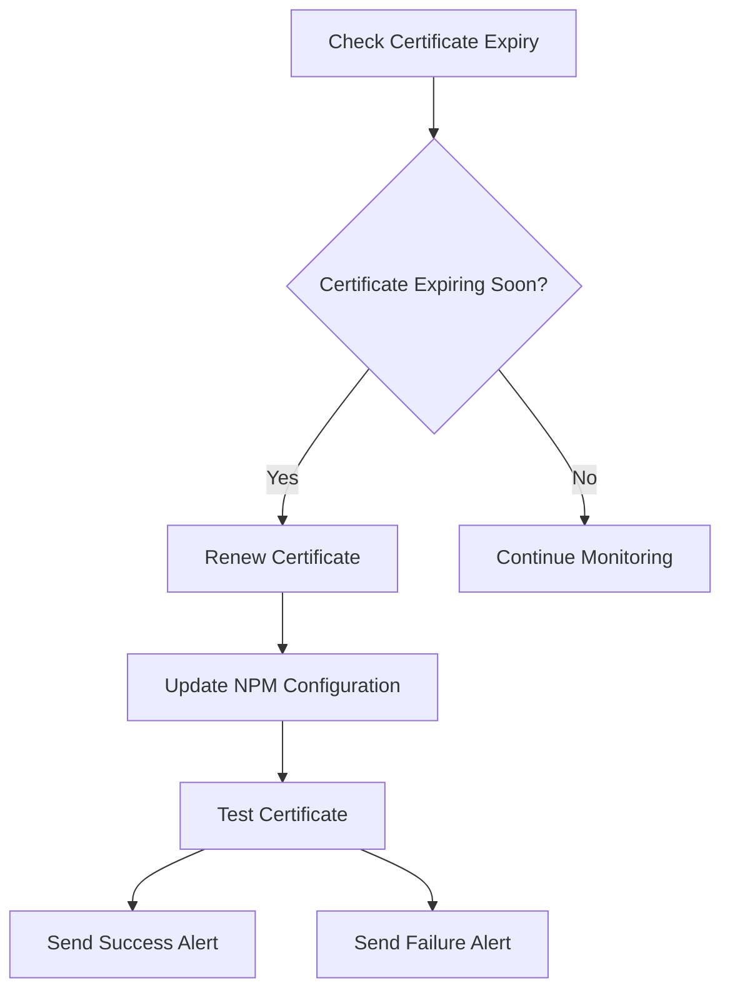
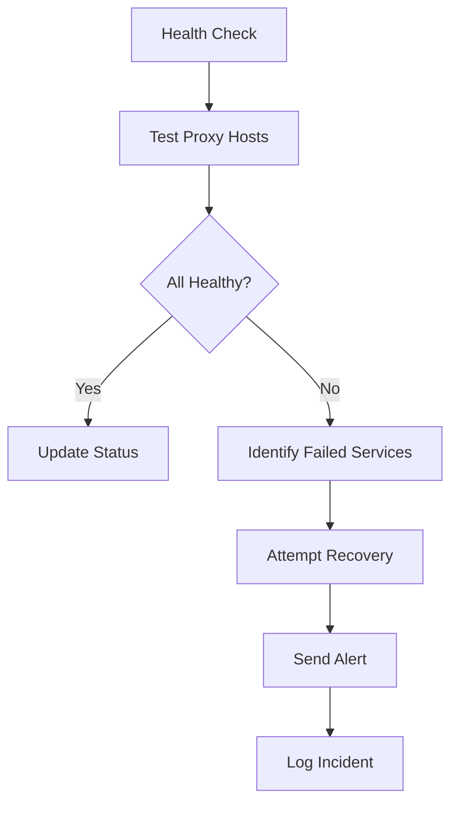

# Nginx Proxy Manager Automation Guide

## Overview

This guide covers the comprehensive automation enhancements for Nginx Proxy Manager (NPM) in your homelab setup. The automation includes service discovery, API-driven configuration, SSL management, monitoring integration, and automated proxy rule creation.

## 🚀 **Enhanced Features**

### **1. Service Discovery Automation**
- **Automatic Service Detection**: Discovers running Docker containers
- **Dynamic Proxy Host Creation**: Creates proxy hosts automatically via API
- **Health Monitoring**: Monitors service health and availability
- **Configuration Management**: Manages SSL certificates and security settings

### **2. API-Driven Configuration**
- **RESTful API Integration**: Full API automation for all NPM operations
- **Programmatic Configuration**: Configure proxy hosts, SSL, and security via code
- **Bulk Operations**: Create multiple proxy hosts simultaneously
- **Error Handling**: Comprehensive error handling and retry logic

### **3. SSL Certificate Management**
- **Automatic SSL**: Let's Encrypt integration with auto-renewal
- **Certificate Monitoring**: Tracks certificate expiration
- **Force Renewal**: Manual certificate renewal capabilities
- **Staging Support**: Test certificates in staging environment

### **4. Security Enhancements**
- **Rate Limiting**: Configurable rate limiting per service
- **WAF Integration**: Web Application Firewall rules
- **Security Headers**: Automatic security header configuration
- **Access Control**: Integration with Authentik for authentication

### **5. Monitoring & Alerting**
- **Health Checks**: Automated health monitoring
- **Metrics Collection**: Prometheus metrics integration
- **Alert Management**: Configurable alerting channels
- **Performance Monitoring**: Response time and error rate tracking

## 📋 **Configuration Structure**

### **Default Variables (`roles/nginx_proxy_manager/defaults/main.yml`)**
```yaml
# Service Configuration
nginx_proxy_manager_enabled: true
nginx_proxy_manager_version: "2.10.4"
nginx_proxy_manager_image: "jc21/nginx-proxy-manager:{{ nginx_proxy_manager_version }}"

# Automation Configuration
nginx_proxy_manager_automation_enabled: true
nginx_proxy_manager_service_discovery_enabled: true
nginx_proxy_manager_auto_ssl_enabled: true

# API Configuration
nginx_proxy_manager_api_url: "http://localhost:{{ nginx_proxy_manager_ports.admin }}"
nginx_proxy_manager_api_username: "admin@{{ domain }}"
nginx_proxy_manager_api_password: "{{ vault_npm_admin_password }}"
```

### **Service Discovery Configuration**
```yaml
nginx_proxy_manager_discovery_services:
  - name: "authentik"
    subdomain: "auth"
    port: 9000
    ssl: true
    auth: false
  - name: "grafana"
    subdomain: "grafana"
    port: 3000
    ssl: true
    auth: true
  # ... more services
```

## 🔧 **Automation Scripts**

### **1. Main Automation Script (`npm_automation.py`)**
```bash
# Discover services and create proxy hosts
python3 npm_automation.py --config automation_config.yml --discover-services --create-proxy-hosts --auto-ssl

# Health check
python3 npm_automation.py --config automation_config.yml --health-check

# Display summary
python3 npm_automation.py --config automation_config.yml --summary
```

### **2. Service Discovery Script (`service_discovery.py`)**
- Discovers running Docker containers
- Checks service health endpoints
- Creates proxy host configurations
- Manages SSL certificates

### **3. SSL Manager Script (`ssl_manager.py`)**
- Manages Let's Encrypt certificates
- Handles certificate renewal
- Monitors certificate expiration
- Supports staging environment

### **4. Health Check Script (`health_check.py`)**
- Monitors proxy host health
- Tracks response times
- Sends alerts on failures
- Generates health reports

### **5. Backup Manager Script (`backup_manager.py`)**
- Automated backup creation
- Encrypted backup storage
- Backup retention management
- Restore capabilities

## 🚀 **Deployment Process**

### **Step 1: Role Deployment**
```bash
# Deploy NPM role with automation
ansible-playbook main.yml --tags "nginx_proxy_manager" --ask-vault-pass
```

### **Step 2: Initial Configuration**
```bash
# Configure API access
curl -X POST "http://localhost:81/api/tokens" \
  -H "Content-Type: application/json" \
  -d '{
    "identity": "admin@yourdomain.com",
    "secret": "your-secure-password"
  }'
```

### **Step 3: Service Discovery**
```bash
# Run service discovery
cd {{ docker_dir }}/nginx-proxy-manager/scripts
python3 service_discovery.py --config automation_config.yml --discover-services
```

### **Step 4: SSL Configuration**
```bash
# Configure SSL certificates
python3 ssl_manager.py --config automation_config.yml --renew-certificates
```

## 📊 **Monitoring Integration**

### **Prometheus Metrics**
```yaml
# Metrics endpoint
metrics_port: 8080
metrics_path: "/metrics"

# Available metrics
- npm_proxy_hosts_total
- npm_ssl_certificates_total
- npm_requests_total
- npm_response_time_seconds
- npm_error_rate_percent
```

### **Grafana Dashboards**
- **NPM Overview Dashboard**: Overall proxy host status
- **SSL Certificate Dashboard**: Certificate expiration monitoring
- **Performance Dashboard**: Response times and throughput
- **Security Dashboard**: Rate limiting and WAF statistics

### **AlertManager Integration**
```yaml
# Alert rules
- alert: NPMServiceDown
  expr: npm_proxy_hosts_healthy / npm_proxy_hosts_total < 0.9
  for: 5m
  labels:
    severity: critical
  annotations:
    summary: "NPM service health degraded"
```

## 🔐 **Security Features**

### **Rate Limiting**
```yaml
nginx_proxy_manager_rate_limit:
  requests_per_second: 10
  burst: 20
  nodelay: false
```

### **WAF Rules**
```yaml
nginx_proxy_manager_waf_rules:
  - "block_sql_injection"
  - "block_xss"
  - "block_path_traversal"
  - "block_remote_file_inclusion"
  - "block_http_methods"
```

### **Security Headers**
```yaml
nginx_proxy_manager_security_headers:
  X-Frame-Options: "SAMEORIGIN"
  X-Content-Type-Options: "nosniff"
  X-XSS-Protection: "1; mode=block"
  Referrer-Policy: "strict-origin-when-cross-origin"
  Content-Security-Policy: "default-src 'self'; script-src 'self' 'unsafe-inline'; style-src 'self' 'unsafe-inline';"
```

## 🔄 **Automation Workflows**

### **1. Service Discovery Workflow**


### **2. SSL Management Workflow**


### **3. Health Monitoring Workflow**


## 📈 **Performance Optimization**

### **Caching Configuration**
```yaml
nginx_proxy_manager_caching_enabled: true
nginx_proxy_manager_cache_path: "/var/cache/nginx"
nginx_proxy_manager_cache_size: "1G"
nginx_proxy_manager_cache_inactive: "7d"
```

### **Compression Settings**
```yaml
nginx_proxy_manager_compression_enabled: true
nginx_proxy_manager_gzip_types: "text/plain text/css text/xml application/json application/javascript application/xml+rss application/atom+xml image/svg+xml"
```

### **Resource Limits**
```yaml
nginx_proxy_manager_resource_limits:
  memory: "512M"
  memory_swap: "1G"
  cpus: "1.0"
  cpu_shares: 1024
```

## 🔧 **Troubleshooting**

### **Common Issues**

#### **1. API Authentication Failed**
```bash
# Check API token
curl -X GET "http://localhost:81/api/tokens" \
  -H "Authorization: Bearer YOUR_TOKEN"

# Regenerate token if needed
curl -X POST "http://localhost:81/api/tokens" \
  -H "Content-Type: application/json" \
  -d '{"identity": "admin@domain.com", "secret": "password"}'
```

#### **2. SSL Certificate Issues**
```bash
# Check certificate status
python3 ssl_manager.py --config automation_config.yml --check-certificates

# Force certificate renewal
python3 ssl_manager.py --config automation_config.yml --renew-certificates --force
```

#### **3. Service Discovery Issues**
```bash
# Check service health
python3 health_check.py --config automation_config.yml --check-services

# Manual service discovery
python3 service_discovery.py --config automation_config.yml --discover-services --verbose
```

### **Log Files**
```bash
# NPM logs
tail -f {{ logs_dir }}/nginx-proxy-manager/nginx-proxy-manager.log

# Automation logs
tail -f {{ docker_dir }}/nginx-proxy-manager/automation.log

# SSL logs
tail -f {{ docker_dir }}/nginx-proxy-manager/ssl.log

# Health check logs
tail -f {{ docker_dir }}/nginx-proxy-manager/health.log
```

## 🚀 **Advanced Features**

### **1. Custom Service Templates**
```yaml
# Add custom service templates
custom_services:
  - name: "custom-app"
    subdomain: "custom"
    port: 8080
    ssl: true
    auth: true
    custom_config:
      proxy_read_timeout: 300
      proxy_send_timeout: 300
      client_max_body_size: "100M"
```

### **2. Multi-Environment Support**
```yaml
# Environment-specific configurations
environments:
  production:
    ssl_staging: false
    rate_limiting: true
    monitoring: true
  
  staging:
    ssl_staging: true
    rate_limiting: false
    monitoring: false
```

### **3. Backup and Recovery**
```bash
# Create backup
python3 backup_manager.py --config automation_config.yml --backup --encrypt

# Restore from backup
python3 backup_manager.py --config automation_config.yml --restore --backup-file backup.tar.gz
```

## 📚 **API Reference**

### **Proxy Hosts API**
```bash
# Create proxy host
POST /api/nginx/proxy-hosts
{
  "domain_names": ["service.domain.com"],
  "forward_scheme": "http",
  "forward_host": "service",
  "forward_port": 8080,
  "ssl_force_redirect": true
}

# List proxy hosts
GET /api/nginx/proxy-hosts

# Update proxy host
PUT /api/nginx/proxy-hosts/{id}

# Delete proxy host
DELETE /api/nginx/proxy-hosts/{id}
```

### **SSL Certificates API**
```bash
# Create SSL certificate
POST /api/ssl
{
  "provider": "letsencrypt",
  "email": "admin@domain.com",
  "domains": ["service.domain.com"]
}

# List SSL certificates
GET /api/ssl

# Renew certificate
PUT /api/ssl/{id}/renew
```

### **Access Lists API**
```bash
# Create access list
POST /api/nginx/access-lists
{
  "name": "Authentik Integration",
  "type": "auth",
  "auth": {
    "provider": "authentik",
    "auth_url": "https://auth.domain.com/outpost.goauthentik.io/auth/traefik"
  }
}
```

## 🎯 **Best Practices**

### **1. Security**
- Use strong passwords for API access
- Enable rate limiting for all services
- Configure WAF rules appropriately
- Monitor SSL certificate expiration
- Use HTTPS for all external access

### **2. Performance**
- Enable caching for static content
- Configure compression for text files
- Monitor resource usage
- Set appropriate timeouts
- Use connection pooling

### **3. Monitoring**
- Set up comprehensive health checks
- Monitor response times
- Track error rates
- Configure alerting thresholds
- Maintain detailed logs

### **4. Backup**
- Schedule regular backups
- Encrypt backup files
- Test restore procedures
- Maintain backup retention policies
- Store backups offsite

## 🔮 **Future Enhancements**

### **Planned Features**
- **Kubernetes Integration**: Native K8s service discovery
- **Multi-Cluster Support**: Manage multiple NPM instances
- **Advanced Analytics**: Detailed performance analytics
- **Machine Learning**: Predictive failure detection
- **GitOps Integration**: Configuration as code

### **Community Contributions**
- **Custom Templates**: User-defined service templates
- **Plugin System**: Extensible automation plugins
- **API Extensions**: Custom API endpoints
- **Dashboard Customization**: User-defined dashboards

---

## 📞 **Support**

For issues and questions:
- **Documentation**: Check this guide and inline comments
- **Logs**: Review automation and service logs
- **Health Checks**: Run health check scripts
- **API Testing**: Test API endpoints directly
- **Community**: Join our community forums

The enhanced Nginx Proxy Manager automation provides enterprise-grade features with comprehensive monitoring, security, and management capabilities for your homelab environment. 